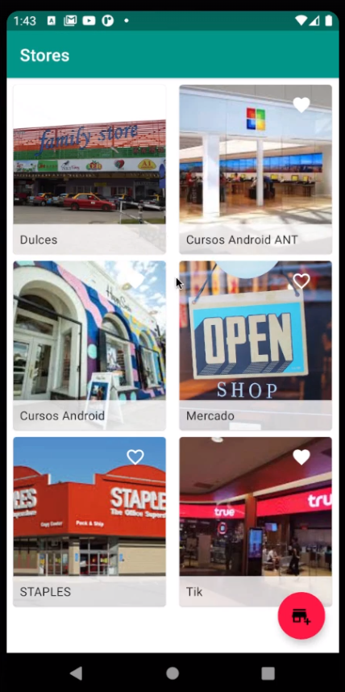
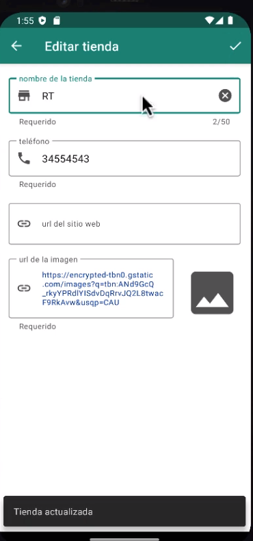
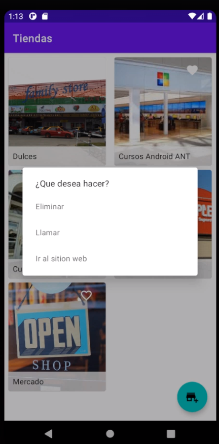

# Stores App

Este proyecto es una aplicación Android desarrollada en Kotlin, que permite a los usuarios gestionar una lista de tiendas. Los usuarios pueden añadir, editar, eliminar y marcar tiendas como favoritas. La aplicación utiliza Room para la persistencia de datos, y sigue el patrón de diseño MVVM para su arquitectura.

## Características

- Ver una lista de tiendas.
- Añadir nuevas tiendas.
- Editar tiendas existentes.
- Eliminar tiendas.
- Marcar tiendas como favoritas.
- Persistencia de datos con Room.
- Arquitectura MVVM.

## Capturas de Pantalla



## Manual de Instrucciones para "Stores App"

### 1. Inicio de la aplicación
Al abrir "Stores App", serás recibido por la pantalla principal que muestra una lista de tus tiendas guardadas.

### 2. Navegación principal
La interfaz es intuitiva, con una lista de tiendas y un botón flotante en la esquina inferior derecha para añadir nuevas tiendas.

### 3. Agregar una nueva tienda
Para añadir una tienda:
1. Pulsa el botón flotante "+".
2. Rellena los detalles de la tienda en el formulario.
3. Guarda la tienda pulsando el icono de guardado.

### 4. Editar una tienda
Para editar una tienda:
1. Pulsa sobre la tienda que deseas editar.
2. Modifica los detalles en el formulario.
3. Guarda los cambios.

### 5. Eliminar una tienda
Para eliminar una tienda, mantén presionada la tienda que deseas eliminar y selecciona "Eliminar" en el menú de opciones.

### 6. Marcar una tienda como favorita
Puedes marcar una tienda como favorita pulsando el icono de corazón en la lista de tiendas.

### 7. Visualizar detalles de la tienda
Pulsa sobre cualquier tienda en la lista para ver todos sus detalles.

### 8. Soporte y contacto
Si tienes preguntas o necesitas soporte, por favor contacta a jlobatonm@gmail.com

## Tecnologías Utilizadas

- **Kotlin**: Lenguaje de programación.
- **Room**: Persistencia de datos.
- **MVVM**: Patrón de arquitectura.
- **Android Studio**: Entorno de desarrollo integrado.

## Instalación

Para instalar y ejecutar este proyecto en tu entorno local, sigue estos pasos:

```bash
git clone https://github.com/JuanJoseLobatonMateos/stores-app.git
cd stores-app
